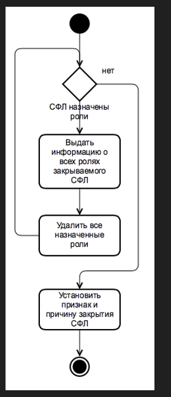
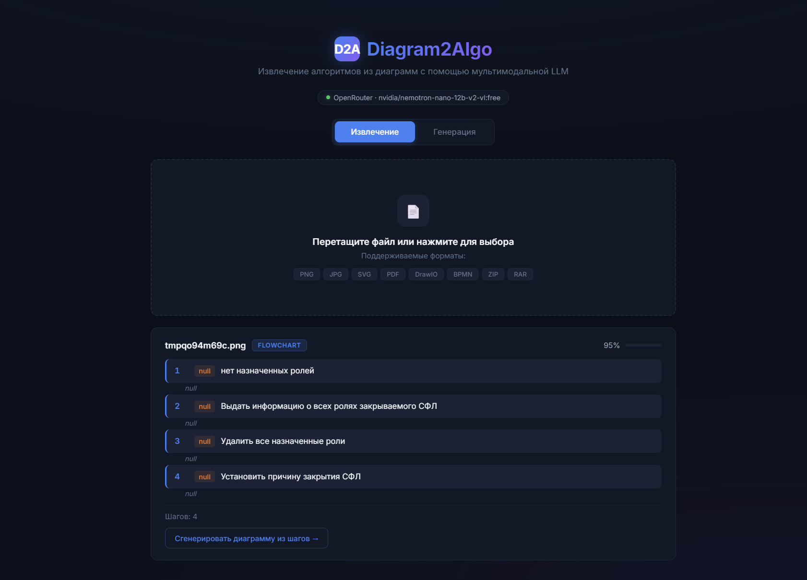
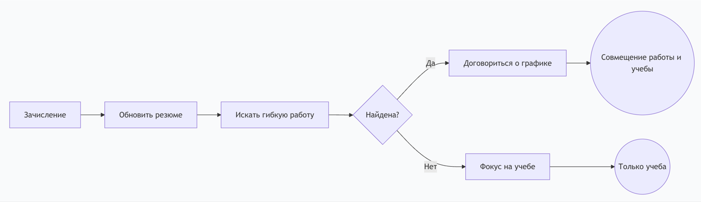
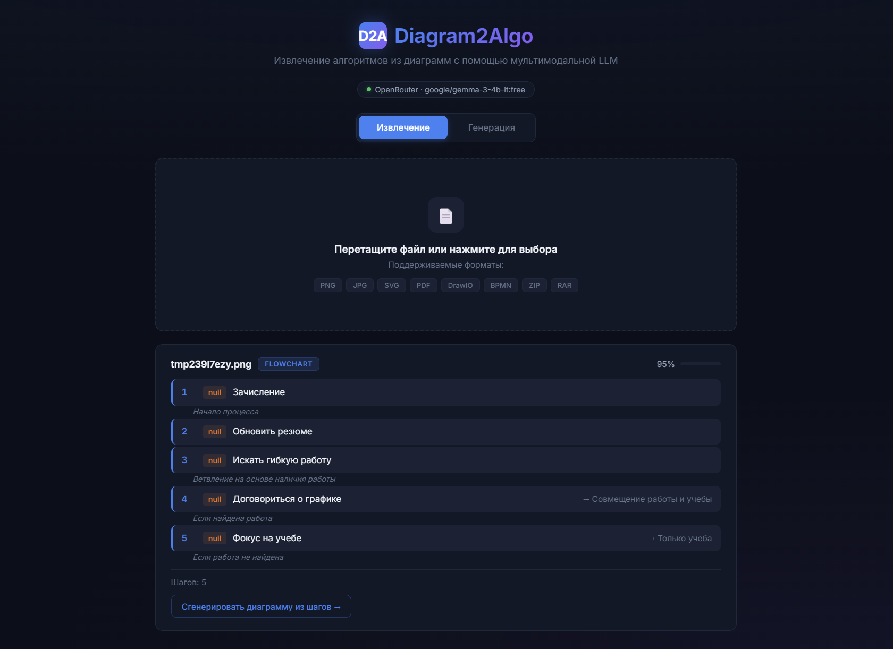
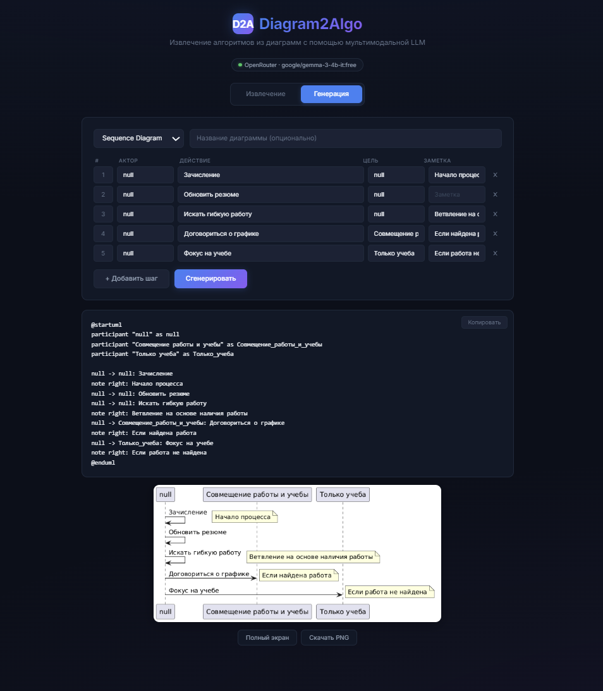
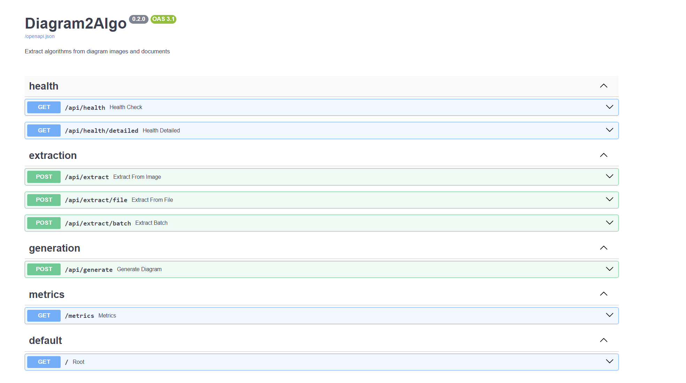
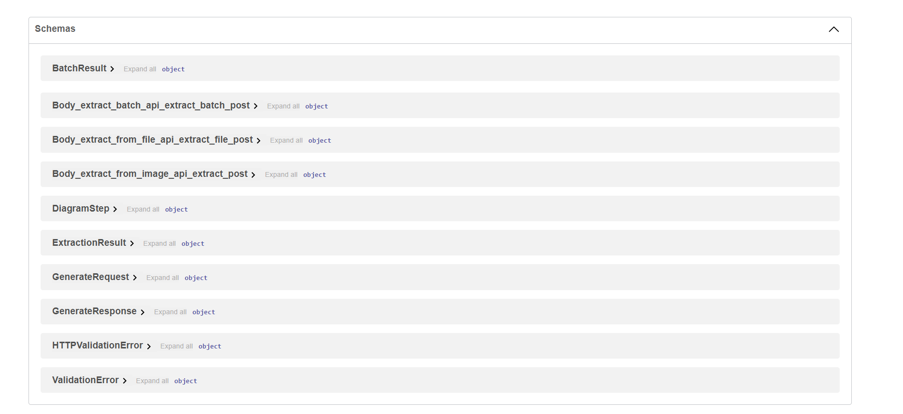

# Diagram2Algo

Сервис для извлечения алгоритмов из диаграмм. На вход — картинка (BPMN, UML, flowchart, что угодно), на выходе — структурированный пошаговый алгоритм в JSON. Есть и обратная задача: по описанию шагов генерируется PlantUML-диаграмма.

Работает через мультимодальную LLM — Gemini по умолчанию, OpenRouter (бесплатные модели) или Ollama для локального запуска. Поддерживается автоматический fallback между провайдерами.

## Примеры

**Извлечение из flowchart:**





**Диаграмма с ветвлением:**





**Генерация диаграммы из шагов:**



**Swagger UI:**





## Запуск

### Docker

```bash
git clone <repo-url>
cd diagram2algo

# прописать GEMINI_API_KEY в .env (см. ниже)

cd docker
docker compose up -d

# если нужен Ollama fallback (нужна NVIDIA GPU)
docker compose --profile ollama up -d
```

### Локально

```bash
python -m venv .venv
.venv\Scripts\activate     # Windows
# source .venv/bin/activate  # Linux/Mac

pip install -r requirements.txt

# прописать GEMINI_API_KEY в .env

uvicorn main:app --host 0.0.0.0 --port 8000
```

После запуска: http://localhost:8000 — UI, http://localhost:8000/docs — Swagger.

## API

**Health check:**
```bash
curl http://localhost:8000/api/health
```

**Извлечение из картинки:**
```bash
curl -X POST http://localhost:8000/api/extract -F "file=@diagram.png"
```

Ответ:
```json
{
  "source_file": "diagram.png",
  "diagram_type": "BPMN",
  "steps": [
    {"number": 1, "actor": "Клиент", "action": "Оформляет заказ"},
    {"number": 2, "actor": "Система", "action": "Проверяет данные"}
  ],
  "confidence": 0.85
}
```

**Извлечение из файла** (PDF, SVG, BPMN, DrawIO, архивы):
```bash
curl -X POST http://localhost:8000/api/extract/file -F "file=@process.bpmn"
```

**Пакетная обработка:**
```bash
curl -X POST http://localhost:8000/api/extract/batch -F "files=@a.png" -F "files=@b.svg"
```

**Генерация диаграммы:**
```bash
curl -X POST http://localhost:8000/api/generate \
  -H "Content-Type: application/json" \
  -d '{"steps": [{"number": 1, "actor": "User", "action": "login"}], "diagram_type": "sequence"}'
```

**Метрики** (Prometheus-совместимые):
```bash
curl http://localhost:8000/metrics
```

## Поддерживаемые форматы

| Формат | Расширения |
|--------|-----------|
| Изображения | PNG, JPG, GIF, BMP, WebP, TIFF |
| Векторные | SVG |
| Документы | PDF |
| XML-диаграммы | DrawIO (.drawio, .dio), BPMN (.bpmn) |
| Архивы | ZIP, RAR, 7Z |

## Конфигурация

Настройки через `.env`:

| Переменная | По умолчанию | Описание |
|------------|-------------|----------|
| `LLM_PROVIDER` | `gemini` | `gemini` / `openrouter` / `ollama` |
| `LLM_FALLBACK_PROVIDER` | `ollama` | fallback-провайдер (пусто — выключен) |
| `GEMINI_API_KEY` | — | ключ Google AI Studio |
| `GEMINI_MODEL` | `gemini-2.0-flash` | модель Gemini |
| `OPENROUTER_API_KEY` | — | ключ OpenRouter |
| `OPENROUTER_MODEL` | `google/gemini-2.0-flash-exp:free` | модель OpenRouter |
| `OLLAMA_URL` | `http://localhost:11434` | адрес Ollama |
| `OLLAMA_MODEL` | `qwen2.5-vl:7b` | модель для Ollama |
| `MAX_TOKENS` | `2048` | лимит токенов |
| `LLM_TIMEOUT` | `180.0` | таймаут в секундах |
| `MAX_IMAGE_DIMENSION` | `1024` | макс. размер изображения |
| `USE_OCR` | `true` | использовать Tesseract |
| `LOG_LEVEL` | `INFO` | уровень логирования |
| `LOG_JSON` | `false` | JSON-формат логов |

### Получение Gemini API ключа

1. Открыть https://aistudio.google.com/apikey
2. Нажать "Create API Key"
3. Вписать в `.env`:
   ```
   GEMINI_API_KEY=ваш-ключ
   ```

Бесплатный tier: 15 req/min, 1M tokens/min для gemini-2.0-flash.

## Архитектура

```
Request → FastAPI (middleware, logging, request_id)
        → Pipeline (detect file type → convert → preprocess → LLM → parse)
        → LLM Provider (Gemini primary, Ollama fallback)
        → JSON Response
```

Основные модули:

- `app/config.py` — конфигурация через pydantic-settings
- `app/llm/` — абстракция над LLM-провайдерами (Gemini, OpenRouter, Ollama), factory с auto-fallback
- `app/pipeline.py` — оркестратор обработки файлов
- `app/routes/` — эндпоинты (extract, generate, health, metrics)
- `app/converters/` — конвертеры форматов (SVG, PDF, BPMN, DrawIO, архивы)
- `app/preprocessing.py` — ресайз, контраст, обработка тёмного фона
- `app/postprocessing.py` — парсинг JSON-ответов LLM, regex-fallback
- `app/exceptions.py` — иерархия исключений с FastAPI-хендлерами
- `app/logging_config.py` — structured logging, request_id через contextvars

## Docker

```bash
# только Gemini (без GPU)
cd docker && docker compose up -d

# Gemini + Ollama (нужна NVIDIA GPU с 8GB+ VRAM)
cd docker && docker compose --profile ollama up -d
```

При профиле `ollama` поднимается контейнер с GPU passthrough, `OLLAMA_URL` переопределяется автоматически.

## Тестирование

```bash
pip install -r requirements-dev.txt
pytest tests/ -v
```

## Стек

Python 3.11, FastAPI, Google Gemini (google-genai SDK), OpenRouter, Ollama, Tesseract OCR, Pillow, PyMuPDF, PlantUML, Docker, GitHub Actions, Pydantic v2.
